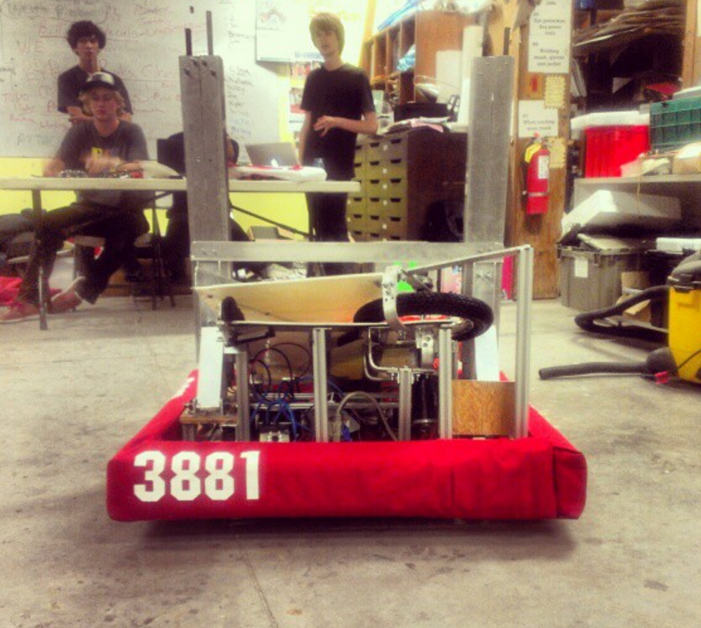

##Preface
While this isn't the first time i have used Javascript, this is the first time I've used it in a traditional programming manner. I have a personal bias against interpretted languages from a speed perspective but I do concede that they often make great beginner languages (Java,Python,Javascript). It must also be stated that i do believe Javascript should generally be avoided for many reasons including: security, transparency, speed, ability (and frequency) to be disabled.

## First Impressions

## Euler Problems

The first time I designed anything on a computer was on the first day of a web- pbuilding class in seventh grade, taught by a teacher who had little more than my grandmother to do with computer.The class was taught using almost exclusively html, and by the end of the day my website was composed of wonky looking frames, colorful backgrounds, and the coolest flash games I could find at the time. Although my website didn’t look pretty or functional, I had completed the entirety of the requirements for the semester and realized two things that changed my life. 

First: I had an insatiable desire to continue creating things, specifically using computers.

Second: I wanted to learn as much about this new found world of human to computer translation. 

By the end of seventh grade I had already begun learning C++ and was making simplistic games using Allegro.

## Development

As time continued I continued growing my skill set and developing new things. Through highschool i participated in Robotics, developing a couple of robots (including one named after me). My true passion, however, was graphical programming like games. I spent much of highschool developing an RPG engine which slowly became a graphic engine as a senior project. While development on this ended, work on other graphical engines continued to even today. 

## The Future?

SDL, AWT, Java, Lisp, SQL, JPages, OpenGL. All of these are things I didn't know about during that first year of programming, but now I holde each of them close to my heart. Everyday i find myself developing more and more, and learning more interesting facts. I don't know where the future will take me, but i hope with all of my heart that I keep learning new things every day.

