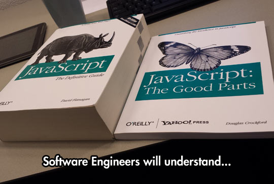

## Preface

While this isn't the first time i have used Javascript, this is the first time I've used it in a traditional programming manner. I have a personal bias against interpretted languages from a speed perspective but I do concede that they often make great beginner languages (Java,Python,Javascript). It must also be stated that i do believe Javascript should generally be avoided for many reasons including: security, transparency, speed, ability (and frequency) to be disabled.

## First Impressions

I began my foray into Javascript by brushing up on the basics using [FreeCodeCamp](https://www.freecodecamp.com/), a website that teaches Javascript in tiny little bite size lessons. After completing several hundred lessons, I feel as if my assessment of Javascript has come to a steady state. 

Javascript is incredibly versatile to a fault. The most notable feature is the ability to change what data type each variable corresponds to. I, as well as many others, would consider this to be neat but ultimately detrimental, thats why I intend to keep data types static for the rest of my time using Javascript. This translates over to arrays which strike me closer to JSON or some data storage language rather than an actual programming language. While the lack of restriction can be a benefit, it personally makes it hard to tell the function of an array just by looking at it. 

I wasn't fond of the way object oriented programming was implemented into javascript at first but the more i played with it the more it felt reminiscent of C. I don't want to say it is limited, as structs are in C, but rather the array like structure has a similiar feel. One thing I found dissapointing was a distinct lack of inheritance. I also question the usefulness of private variables in a setting like this. 

## Euler Problems

In order to truly understand the usefulness of Javascript I took on the first couple of Euler problems. 

### Euler Problem 1

 This first Euler problem is adding all of the numbers between 0 and 1000 that are divisible by 3 or 5. This was particularly easy to implement in Javascript. The syntax was very similar to c, set asside the function and and distince lack of a main function. While it wasn't strictly necessary I decided to use the === operator. 
 
 In total this took only 1 Minute and 26 seconds to perform and was correct on the first attempt. My solution can be found [Here on JSFiddle](https://jsfiddle.net/jleech/7akb1hue/)

### Euler Problem 2

The second Euler problem is to add all of the Fibonacci numbers up that are even. This problem showed one of Javascripts biggest weaknesses. My initial solution was to try and perform the problem recursibely, this quickly showed to be too slow and require to much memory. This solution was created in 4 minutes and proved to be correct using a faster programming language.

The second attempt of this problem used an interative step which could be almost indistinguishable from any other language. This worked speedily, and the solution was found in 2 minutes and 10 seconds.

The final solution to this problem can be found [Here on JSFiddle](https://jsfiddle.net/jleech/ytbwu25L/)

