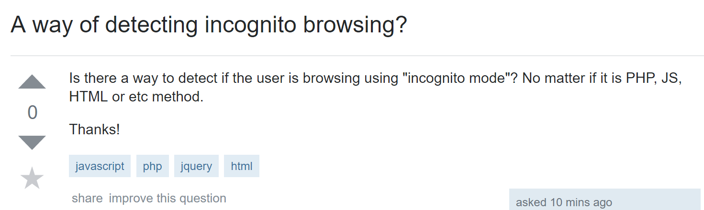

## Preface

Communication is the basis for human society and somewhere along the lines that trickled down to software engineering as well. While code can be interpreted by looking at it or by careful trial and error most people find themselves at the person oriented end of a book or video. The problem with both of these mediums is that they are finite. Furthermore, Employers don’t want you to program something that’s already been done and professors don’t want you to be working on an assignment which can easily be searched for. 

StackOverflow is where many people end up when they feel they have exhausted their options (for some that point come much quicker than others). A quick glance will show a wide variety of quality in answers and questions. Many people come here searching for others to “fix their code”.  A fair amount of these people receive this, in the form of wordless answers. This forms a reliance, especially on newer programmers. Which leads me to my hypothesis: Better questions, lead to better answers, lead to less reliant programmers. 

## Experiment

For the sake of this experiment I will be examining a few questions on StackOverflow. Their content will be judged based on a set of guidelines created by Eric Raymond, in the article <a href="http://www.catb.org/esr/faqs/smart-questions.html#forum">“How to ask questions the smart way.” </a>

At first this question seems innocent. I'd make the reasonable assumptions that this was made by someone relatively new to the scene. However, I would like to argue that this is what makes the content of the question more valuable.

### First Question

**The Bad**

  The most notable rule that this question breaks is choosing to ignore standard english grammer. While not incredibly hard to read, it is offputting. It should be noted that the question in the title is not in fact a question.
  
  While a lesser offense, the author does attempt to give his idea of what the problem could be to the user. He makes a (gramattically incorrect) statement, in which he mentions several of the options available to him to solve the problem. This adds on to the fact that the author is not describing what he is actually attempting to do. While it is obvious that the author wants to tell if a website can detect if a user is using incognito mode, it is impossible to give a good answer without knowing the full scope of the project and what other hurdles there might be.
  
  While the user breaks a fair ammount of rules there are two rules that were broken that I would consider to be the worst offenses. In lue of a lack of forums StackOverflow filters itself by tags, which this author chose to intentionally disrespect. It's obvious from the question that he did not know which this belonged in. Rather than asking a more specific question he chose to put this question in several unrelated tags and let the browsers choose. 
  
  Which brings us to the last final golden rule of asking a good question. **Make sure it hasn't been asked.** The second comment reply to this question is a link to the same question being asked previously. To which the author would swiftly find out there is already an answer. Do not let people be your search engines. 
  
**The Good**

  Desipite being a question I would throw into the "Bad" category, it is important to also understand what this question has done right. This question is direct with the way it asks a question. While the question falls into the cutesy category, it does a good job of focussing it's intent. It doesn't shout the question out into the void, but rather the problem is stated in an easy way for the question to be answered.
  
 ### Second Question
 
 **The Good**
 
 **The Bad**
