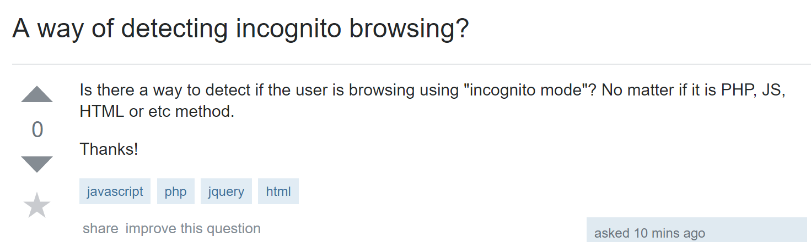
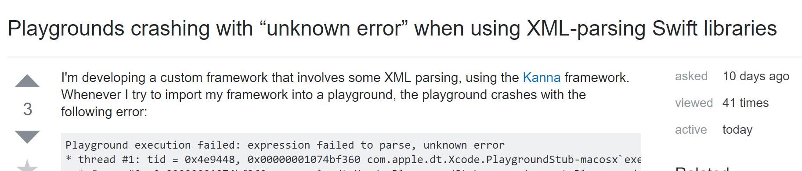

## Preface

Every programmer knows the struggle of deciding between tabs and spaces despite it not mattering for most languages at a compiler level. However it seems like almost everyones opinions on the matter are fairly strong. Is it worth it? Furthermore is it a sympotm of a larger problem? Of course it is!

The tabs versus spaces argument is a small part of the larger scope of Coding Standards. Coding Standards are a system put in place to keep code standardized to a single format. It's important to note that these are put in place by developers not by the language themselves. Using spaces to denote blocks in Python is a quirk of the language, using spaces in C is an example of Coding Standards. It is also important to note that Coding Standards try to standardize a near infinite combination of coding preferences, not just white space. For an example see <a href="https://github.com/airbnb/javascript">AirBNB coding style</href>

To truly understand the importance of Coding Standards, we will look at a few examples, starting with a world where the tabs versus space debate doesn't exist.

### Example 1: 

**The Bad**

  The most notable rule that this question breaks is choosing to ignore standard english grammer. While not incredibly hard to read, it is offputting. It should be noted that the question in the title is not in fact a question.
  
  While a lesser offense, the author does attempt to give his idea of what the problem could be to the user. He makes a (gramattically incorrect) statement, in which he mentions several of the options available to him to solve the problem. This adds on to the fact that the author is not describing what he is actually attempting to do. While it is obvious that the author wants to tell if a website can detect if a user is using incognito mode, it is impossible to give a good answer without knowing the full scope of the project and what other hurdles there might be.
  
  While the user breaks a fair ammount of rules there are two rules that were broken that I would consider to be the worst offenses. In lue of a lack of forums StackOverflow filters itself by tags, which this author chose to intentionally disrespect. It's obvious from the question that he did not know which this belonged in. Rather than asking a more specific question he chose to put this question in several unrelated tags and let the browsers choose. 
  
  Which brings us to the last final golden rule of asking a good question. **Make sure it hasn't been asked.** The second comment reply to this question is a link to the same question being asked previously. To which the author would swiftly find out there is already an answer. Do not let people be your search engines. 
  
**The Good**

  Desipite being a question I would throw into the "Bad" category, it is important to also understand what this question has done right. This question is direct with the way it asks a question. While the question falls into the cutesy category, it does a good job of focussing it's intent. It doesn't shout the question out into the void, but rather the problem is stated in an easy way for the question to be answered.
  
### Second Question

 **The Good**
 
  The title for this question is amazingly written, it describes the error and three of the four seperate building blocks that make up the function. The title isn't formed like a question which seems counter intutitive but actually serves a distinct function. First, questions add excessive words or a sense of grovelling. This is both offputting and inefficient. Secondly statements allow for other users who will have similiar problems to look up the problem. 
  
   The conciseness continues with the first paragraph of text. The author gives a small run down of the project in its entirety without being wordy. He describes the processes he is trying to use and then immedietly follows it up with the error. While the author realizes that he does not understand that error code, specifically because it is an "unknown error" he does not discount the fact that someone else might be more familiar with that particular problem. To compound on this further, he released his code on a seperate Github page. This allows for the question page to not be bogged down with snippits of code, while allowing access to material that might be necessary. 
   
   The second to last section describes the users attempts made so far to remedy the issue. While this seems similiar to describing possible actions there is a distinct difference. Firstly this shows that several attempts have been made by the author before going to other people for help. While this isn't that important it does build a trust between the problem haver and the solvers. Secondly and more important it shows several solutions that the author has not been succesful with, that other might have suggested.
   
 **The Bad**
 
 While for the most part this is a very well written question, even the greats trip from time to time. The last paragraph is the only place where I feel the author has done poorly. He grovels slightly, stating that he is at his "wit's end" and asks what he is doing wrong. He also slightly implies that using any of the solutions he attempted before will all end poorly. This slightly invokes a desire to throw any of those away as near solutions. Other than that the query is well written.
