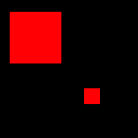
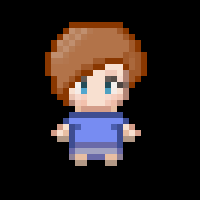
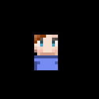

[This project is available on GitHub](https://github.com/joryleech/JEngineCPP)
## Project Goal

The goal of this project was to iterate on the previous version of JEngine, while also reaping the benefits of controlled memory system.

The first version of JEngine was performed using Java and AWT. Because of this it became very difficult to control the memory being used in the program. This meant it was fine for smaller projects, but larger projects had issues running. Furthermore, as far as I could tell there was no hardware acceleration. 
These two issues forced the entity cap to hover around 14000 on my current hardware. The new system boosts this to almost 10x that amount. 

## Skills Used

The main resources used were:
* SDL
* C++ 

## Personal Involvement

  I was the sole developer and resource creator of this project, and the previous project. Various others have made demos using the engine.

## Current State
 
  **Entity Based**. All images, rectangles, text, or other things that might need to be rendered are considered Entities. This entity class gives each object a position, scale, and several other functions that can be used across any of the subclasses.

  

  **Geometry Rendering**. This allows the user to render simple geometry. The back end of this is actually 3D OpenGl. This allows the application to take full control of Hardware accelerated floating point calculations offered by any GPU.
  
  
  
  **Image Rendering**. This allows the developer to render images to the any render surface. This should take care of importing any images, and rendering them to the screen. This is handled as an OpenGL texture and a 3d plane, to once again take advantage of Hardware acceleration.
  
  **Image Dependence**. This is a memory saving function that is done automatically that allows the user to duplicate an image multiple times without taking more memory to re-import it. This allows the entity cap for images to climb significantly. 
  
  **Time Dependant Calculations**. These allow users to calculate the state of the world independantly of the frame rate. This can be very beneficial for games that might have fluctuating frame rates. They are generally more processor intensive, but are currently in style for computer games.
  
  **Frame Dependant Calculations**. The counterpart to time dependant calculations. These instead calculate the state of the game world each frame that passes, with no difference.
  
  **Bounding Box Collision**. This allows users to check for collision between any two squares. It was simplified to allow the developer to just initialize it with an element. 
  
  **Basic Bounding Box Hardbody Physics** A simple calculation to force hard bodies away from each other, this allows a basic collision to stop and push back other objects so that they can not pass. 
  
  

  
  **Multiple Render Surfaces**. This function allows the user to render onto another surface, besides the generic window surface. This function can be used to: 
  * Clip Images
  * Create a  layered effect for images
  * Offer the user multiple distinct windows.
  
  **Input Manager**. This input manager gives the user access to any of the inputs from the user that they requrst during any part of the application. This was designed to solve a common problem in input managment, that causes information to be lost once it is collected, or that restricts input dependant actions to take place in a single function.
   

## Features In Development
  **Rendered Text**. This will allow the users to render text, by treating it as a string rather than an image. From a player perspective this has no effect, but from a developer perspective it streamlines any text dependant development.
