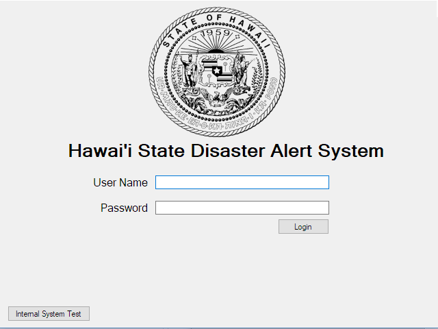

## Project Goal
This project was designed to minimize Slips and Errors that could occur in an emergency alert system, as used by a normal citizen. This was inspired by a brief moment where the real Hawaii emergency alert system went off, scaring thousands into thinking they were about to die. 
This project was performed with a group of three software engineers, utilizing test-based development. User interaction and experience were of the upmost importance for this project. 

## Skills Used
  The main resources used were:
  * Python
  * SQLite3
  * Sockets
  
## Personal Involvement
I was responsible for collaborating on the redesign, as well as implimenting the UI, text messaging, and login systems. 
  

## Paper Prototype
Each member began by designing their own paper prototypes, with at least one that minimized slips and one that minimized errors.
These were combined to create this initial paper prototype which was then tested on 6 different users, along with a small survey about their experience using the prototype.

## Features
  **Login/Personal Logs:** The system keeps a log of important actions performed on the system as well as who performed them and when. This is to keep accountability high.
  **Current Emergency Status:** This simple line near the top of the forms, lets the user know if there is currently an emergency. This also locks certain functionality if there is no emergency (which can be overridden). This was put in place since it was later discovered that the user who made the mistake was in the belief that there was an actual emergency.

## Screenshots
(click to enlarge)

