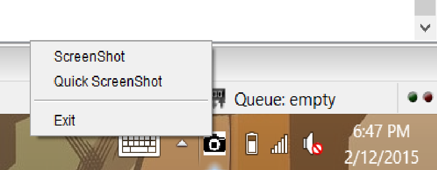

  
  

JEngine was a wrapper I began desinging in highschool to make game development easy, on top of some convoluted graphical proccessing as designed by Java. The engine was designed focussed on Entities, in an Object Oriented Fashion. Each image, primitave shape, text, and input was treated as an Entity. 

For the original beta of this project I lead a small team of three people, and acted as the team lead and lead programmer. This version was scrapped due to underlying issues in program structure. 
 
For the final version of this project I was the Sole developer. The final version of this project was written from the ground up, keeping only learned experience and the name from the beta. 

