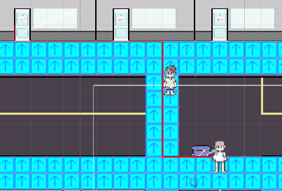

---
layout: project
type: project
image: images/pathfindingLogo.png
title: Network Sharded Database
permalink: projects/networkShardedDatabase
date: 20180505
labels:
  - Python
  - SQLite3
  - Sockets
summary: Integration of sharding algorithms over a networked connection for a database.
---

## Project Goal
This project was created to create a multi-node database, that acts as a modular and expanding system. The program requires only 2 nodes at a minimum to function: One being a catalog node that provides access information for a minimum of one (or zero if no data is currently stored) other nodes. 

## Skills Used
  The main resources used were:
  * Python
  * SQLite3
  * Sockets
  
## Personal Involvement
I was the sole developer and resource creator of this project.
  
## End Product

* 

## Screenshots

