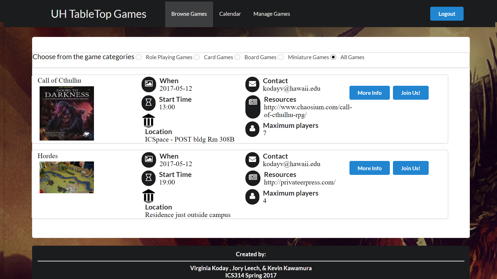

## Project Goal
  Tabletop Manoa was designed to be a website for University of Manoa students to find groups who play tabletop games. 
  The initial idea was proposed to create a safe and more restricted environment where college students can be assured that the other players are all students. 
  
  Along with safety the application was designed to solve many of the issues that come with planning and coordinating a game. 
  The website allows for users to find games that match their preferred systems or schedules, without having to rearrange their game for everyone.
  

## Skills Used

The main resources used were:
* Unity
* C# 
* Blender
* Maya
* Team Leading

## Personal Involvement

## End Product

### Features

  **Prop Grabbing** Props can be dynamically moved as if by grabbing with an actual hand. 
  
## Screenshots
 

