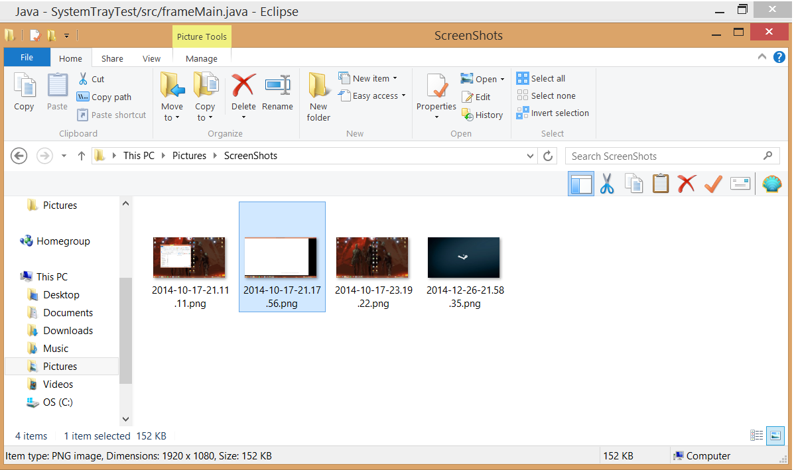
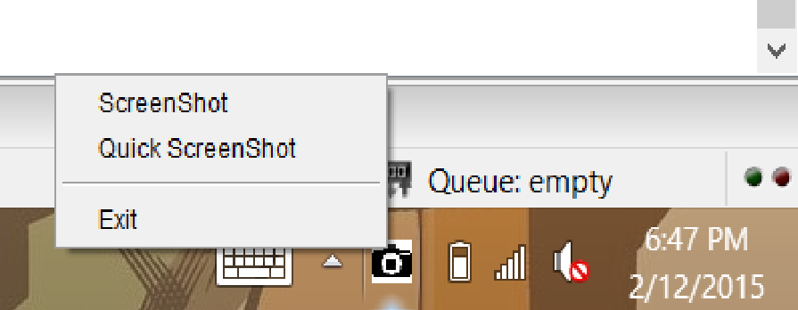

## Project Goal

Screeny was created to give windows users a screenshot functionality similiar to that of what mac users have. By default the windows screenshot utility only places the screenshot in the clipboard. Windows also has the snipping tool available. Both of these options require the user to open up another window **each** time the user wants to take a screenshot. I found this to be unusable in any high speed interactions. 

## Skills Used

The main resources used were:
* Java
* [JNativeHook](https://github.com/kwhat/jnativehook)

## Personal Involvement
I was the sole developer and resoource creator of this project. 

## End Product

 The end product was capable of taking screenshots and placing them into any specified folder. 
 
 
 
 <h3> Features </h3>
 
 **Keyboard Hook**. This keyboard hook was arguably the most difficult part of this project. This was required since, by itself, java does not allow for users to intake user input if the window is not focused. This is because it can generally be considered a security hazard.
 
 **User Interface**. This small user interface allows the user to select between two options. This was a necessity as the keyboard hook only observes a single key.
 
 **Screenshot**. This function allows the user to take a screenshot of the current screen. When this option is selected from the UI, the user will select the folder where the application will save the picture. 
 
 **Quick Screenshot**. This is the function used when the user presses their keyboard screenshot button. This function saves the picture to the last folder that was saved to, or the default folder .
 
 <h2> Screenshots </h2> 
 All taken with the application.

