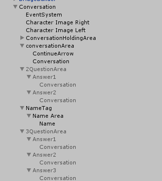
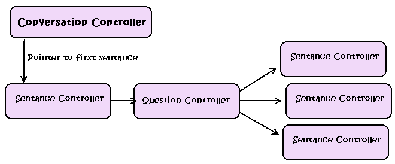

[This project has an Official Page Here](http://hibernationstudios.x10host.com/)

 <iframe width="560" height="315" src="https://www.youtube.com/embed/-0131KbrKWc?rel=0" frameborder="0" allow="autoplay; encrypted-media" allowfullscreen></iframe>

  
## Project Goal

The goal of this project was to create a Game Demo based on Dating Sim qualities over the span of a few weeks. 

The team was comprised of a small group of 3 Artists and 2 Software engineers, with the original plan leaning towards a traditional dating sim experience. This transformed towards a Dating Sim 3D Platformer which the game became, including a cast of lovable ghosts, platforming challenges, individual storylines and a game about friendship in the macabre.
## Skills Used

The main resources used were:
* Unity 
* C#
* Audacity
* Blender

## Personal Involvement

I was the lead programmer in charge of a team of one other programmer, and 3 artists. As a team lead I was responsible for scheduling members, maintaining expectations, and bridging the gap of understanding between artists and programmers.

As a developer I was in charge of: The character controller, the dialog system, converting stories from the artists to the program, and maintaining our source code control. 

I also create the 3d Mesh for the town using blender, and it was textured by the art students. 

## Dialog System. 

  The dialog system was designed to be modular, and can be seperated into three seperate segments. 
  
  1. The UI.
  2. The Sentance Structure
  3. The Background and Bridge Code
  
### The UI

  
  
  The UI was structured by hand to try and follow the conventions of normal dating sim conversation areas. This part is mostly trial and error to get everything right, but the heirchy used can give you an idea of the aspects that were needed. 
  The main conversation object holds all of the scripts that are necessary to run the conversation. The eventsystem is required for input to work. In our game the left character and the right character were two separate object, but I would recommend another empty object with ~5 characters to fit each situation. These can be moved and manipulated by the scripting later on. 
The conversation holding area holds each sentence which will be described in the sentence structure segment.

Each object that ends in the name area {conversationArea, 2QuestionArea, etc...} are the different types of inputs or outputs that are available for the conversation. The "conversationArea" is used for normal sentences where the objects inside are a text object, and an image for a moving arrow. The question areas work similarly with Unity UI buttons instead of just text.
Most of the other objects mentioned are just images, that should be anchored around the entirety of the screen so that they stretch correctly, or to the bottom of the screen if you would like them to not stretch.

### The Sentance Structure

  
I decided to go for a **node based system** for the conversations, if you are familiar with linked lists it is similar to that. Each time text appears on the screen it is referred to as a "Sentance", with a sentance class that exists and several other classes that extend it. This includes different sentence types for regular sentences and each type of question.

Each sentence connects to another sentence, normal sentences connect to one, while questions connect to multiple. This allows the user to create scripts in trees, that can be easily converted to this system. 

 The scripts should be so that anything that can be different in any screen should be changeable through these sentence scripts. 

### The Bridge Script

Or as I called it the conversation controller. Each conversation has exactly one of these, this script is intended to perform all operations that should effect the input and output. It controls which area is currently active, as well as displaying each sentence and how to respond to changing the sentence. 
  
## Screenshots

## Art
