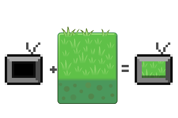

[This project has an Official Page Here](http://hibernationstudios.x10host.com/)

 <iframe width="560" height="315" src="https://www.youtube.com/embed/-0131KbrKWc?rel=0" frameborder="0" allow="autoplay; encrypted-media" allowfullscreen></iframe>

  
## Project Goal

The goal of this project was to iterate on the previous version of JEngine, while also reaping the benefits of controlled memory system.

The first version of JEngine was performed using Java and AWT. Because of this it became very difficult to control the memory being used in the program. This meant it was fine for smaller projects, but larger projects had issues running. Furthermore, as far as I could tell there was no hardware acceleration. 
These two issues forced the entity cap to hover around 14000 on my current hardware. The new system boosts this to almost 10x that amount. 

## Skills Used

The main resources used were:
* Unity 
* C#
* Audacity
* Blender

## Personal Involvement

I was the lead programmer in charge of a team of one other programmer, and 3 artists. As a team lead I was responsible for scheduling members, maintaining expectations, and bridging the gap of understanding between artists and programmers.

As a developer I was in charge of: The character controller, the dialog system, converting stories from the artists to the program, and maintaining our source code control. 

I also create the 3d Mesh for the town using blender, and it was textured by the art students. 

## Dialog System. 
 
  **Entity Based**. All images, rectangles, text, or other things that might need to be rendered are considered Entities. This entity class gives each object a position, scale, and several other functions that can be used across any of the subclasses.

  

  **Geometry Rendering**. This allows the user to render simple geometry. The back end of this is actually 3D OpenGl. This allows the application to take full control of Hardware accelerated floating point calculations offered by any GPU.
  
  
  
  **Image Rendering**. This allows the developer to render images to the any render surface. This should take care of importing any images, and rendering them to the screen. This is handled as an OpenGL texture and a 3d plane, to once again take advantage of Hardware acceleration.

  
  

  
  **Multiple Render Surfaces**. This function allows the user to render onto another surface, besides the generic window surface. This function can be used to: 
  * Clip Images
  * Create a  layered effect for images
  * Offer the user multiple distinct windows.
  
  **Input Manager**. This input manager gives the user access to any of the inputs from the user that they requrst during any part of the application. This was designed to solve a common problem in input managment, that causes information to be lost once it is collected, or that restricts input dependant actions to take place in a single function.
   
## Screenshots

## Art
