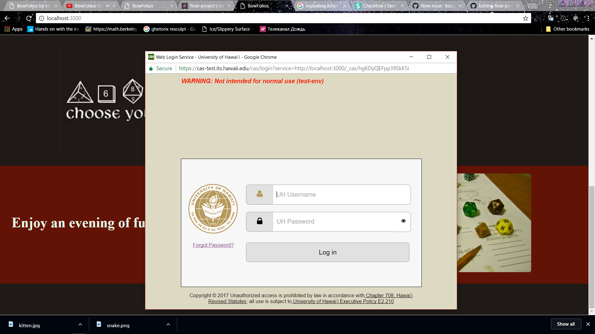
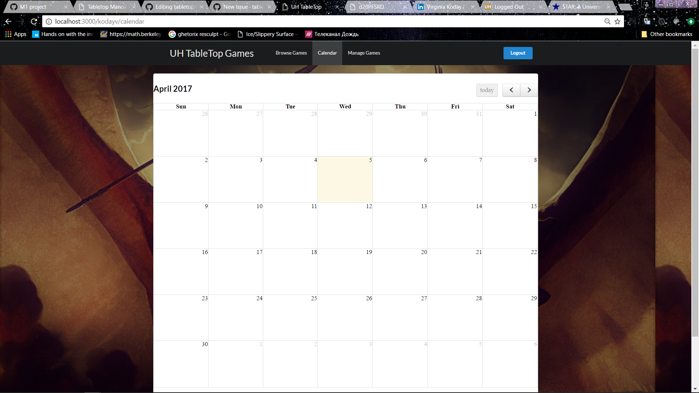
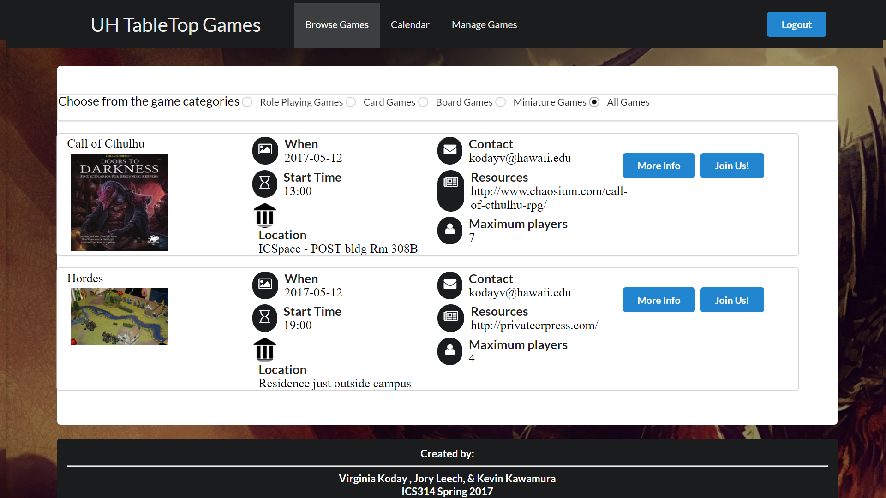
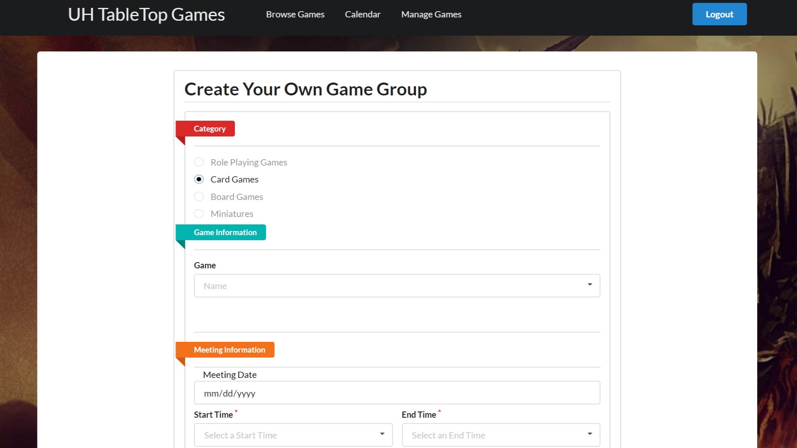

[This project is available on GitHub](https://github.com/tabletopmanoa/Tabletop-Manoa-Website)
## Project Goal
  Tabletop Manoa was designed to be a website for University of Manoa students to find groups who play tabletop games. 
  The initial idea was proposed to create a safe and more restricted environment where college students can be assured that the other players are all students. 
  
  Along with safety the application was designed to solve many of the issues that come with planning and coordinating a game. 
  The website allows for users to find games that match their preferred systems or schedules, without having to rearrange their game for everyone.
  

## Skills Used

The main resources used were:
* Javascript
* Intellij
* Semantic UI
* Meteor
* MongoDB

## Personal Involvement
I worked along side Virginia Koday and Kevin Kawamura to create the Tabletop Manoa Website. Along with the initial idea, I was in charge of creating the browse page, the user page, and redesigning the visuals of the page. 

All members of the team were responsible for maintaining functionality between pages and assisting with others work when necessary.

## End Product

The end product was a website that could be deployed for the Tabletop Club at University of Hawaii at Manoa, or could easily be changed to work for any university. 

### Features
  
 
 
  **CAS Log In.** The UH Manoa log in system was implemented into the application as a secure way to handle personal data, as well as force a restriction on users. This by itself creates a safe environment where users can be certain that people are who they say they are and be held accountable.
  
  **Personalized User Page.** The personalized user page allows the users to see and edit the games they have made or are part of. This can make scheduling around peoples games, or even finding information way easier.

  **A Reactive Add Page.** This page allows users to crate their own games and also changes depending on what information they input. This usually means restricting options. This creates a system where users won't input the incorrect option. While this might seem like a negative, it is considered a useful tool in the field of HCI. 
  
   
  
  **Calendar.** This calendar lets users sort the games by date, and allow them to visually see what is coming up, in a way that is familiar to them. 
  
  **Detailed Information Page.** This page gives users a detailed explanation of what that game will entail. 
  
  **Reactive Browsing/Searching.** The browse page can automatically react to how the user wants to sort the games. This means that without reloading the page, 
  
## Screenshots
 

  

  

   
