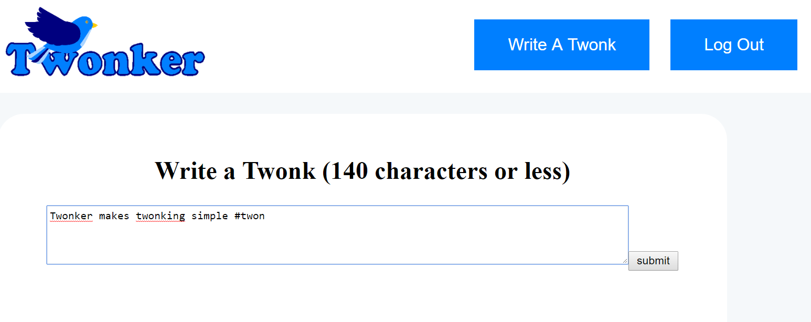

Vacay is a web application that I helped create as a team project in ICS 415, Spring 2015. The project helped me learn how to design and implement a responsive web site.

Twonker is a web application that I created in ICS 321, Fall 2016. The project helped me learn how to design web pages with a Data base structured back end. 

Twonker is implemented using JPages and Derby, a SQL database. The project took a week of work, and includes tweeting, hashtags search and creation, account creation, and logins.

In this project I gained experience with SQL and database backed web programming. This includes: JPages to design Web2.0 pages and Derby for data storage.
